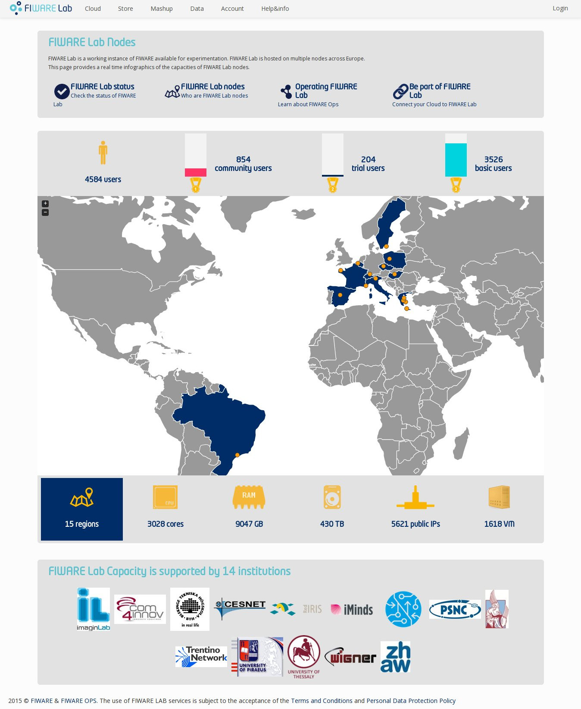
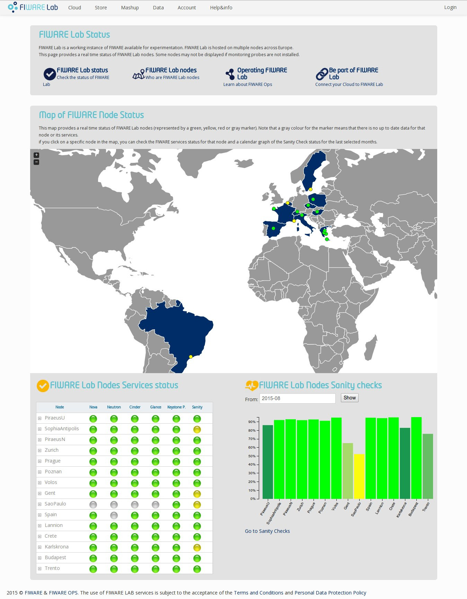
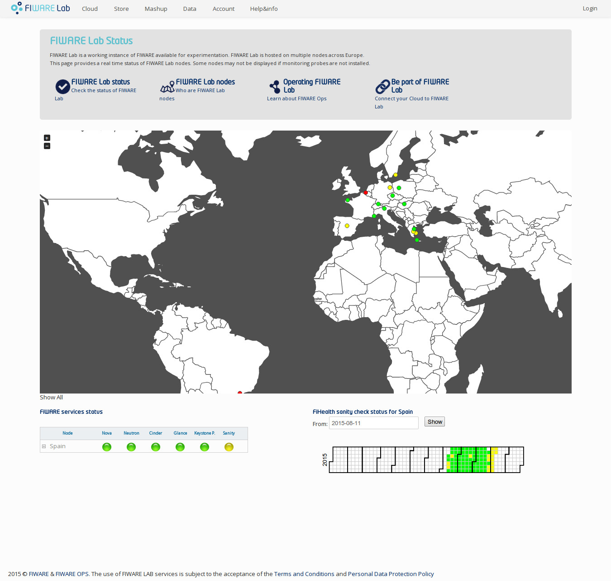
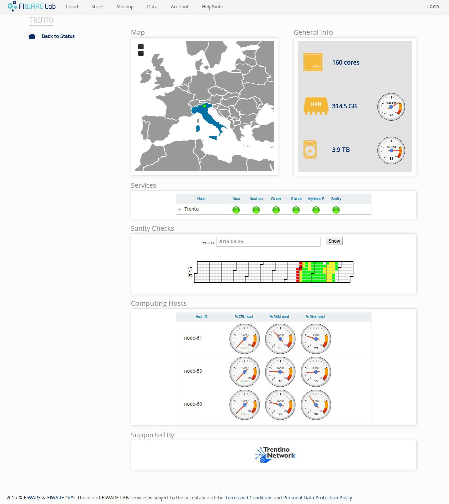

User Guide
==========

Main Page
----------

The following figure shows the main page of the Infographics tool. 

It is composed by:

- a big map that shows all nodes;
- seven interactive tabs that display different data;
- the list of FIWARE Lab Capacity supporters;

The user can click on each tab in order to display more details on the map.
Here a short description about each tab:

- Users: is the total number of users. It is the sum of Basic Users, Trial Users and Community;
- Regions, Organizations, Institutions: is the total number of nodes, organizations and institutions;
- CPU (Cores): is the total number of physical cores. When the tab is selected, the map shows virtual and physical cores for each node. Moreover the amount of available cores is displayed;
- RAM (GB): is the total number of physical ram. When the tab is selected, the map shows virtual and physical ram for each node. Moreover the amount of available RAM is displayed;
- Disk (TB): is the total number of disk. When the tab is selected, the map shows available disk/total disk for each node. Moreover the amount of available Disk is displayed;
- Public IPs: is the total number of public IPs. When the tab is selected, the map shows available public IPs/total public IPs for each node;
- VM: is the total number of VMs. When the tab is selected, the map shows the number of VMs for each node;

When data about a specific node are obsolete, the node in the map is grey and the user can check time of its last update by passing the cursor over it.

Status Page
----------

   
The Status page is composed by:

- a big map that shows all nodes and their overall status (green, yellow or red);
- a table with all FIWARE Lab nodes services status;
- an histogram that shows the average on the last selected months of the sanity check status for each node.

By clicking on a specific node in the map, the user can check FIWARE services status for a given node and a calendar graph that shows its sanity check status of the last selected months.

   
Node Page
----------

By clicking on a specific node in the map in the Main Page or by clicking on the nodes' names inside table in the Status Page, all data about the specific node are displayed.

   
The Node page is composed by:

- a map that shows node location and its overall status (green, yellow or red);
- CPU, RAM and Disk and their used percentage;
- a table with all services status;
- a table with all computing hosts;
- the list of node supporters;